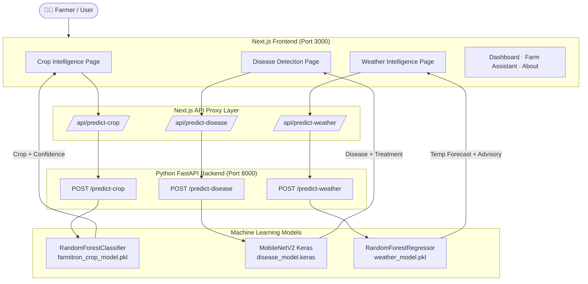

# FARMiTRON 🌾
### *Smarter Decisions. Stronger Harvests.*

> **FARMiTRON** is a full-stack AI-powered agricultural intelligence platform designed for small and marginal farmers in India. It combines machine learning, computer vision, and weather forecasting to deliver real-time, actionable insights that help farmers make better crop, disease, and field-management decisions.

[](https://nextjs.org/)
[](https://fastapi.tiangolo.com/)
[](https://python.org/)
[](https://tensorflow.org/)
[](https://scikit-learn.org/)

---

## Problem Statement

India has over 120 million small and marginal farmers who collectively cultivate more than 86% of the country's farmland. Despite this, most of them:

- Lack access to data-driven **crop selection** guidance for their local soil and climate conditions.
- Cannot afford professional agronomists to **identify plant diseases** before significant crop damage occurs.
- Have no access to **localized weather intelligence** that translates forecasts into actionable farm decisions.

The result is avoidable crop losses, inefficient use of pesticides and fertilizers, and reduced farm profitability.

---

## Solution

FARMiTRON provides three integrated AI modules accessible through a premium web interface:

1. **Crop Intelligence Engine** — Recommends the optimal crop based on real soil and climate data.
2. **Disease Detection AI** — Identifies leaf diseases from uploaded plant images with treatment plans.
3. **Weather Intelligence Forecast** — Predicts tomorrow's temperature and translates it into farm action advisories.

All predictions are powered by locally-hosted ML models served through a FastAPI backend, ensuring low latency and data privacy.

---

## Key Features

- 🌱 **ML-Powered Crop Recommendation** using soil NPK, pH, temperature, humidity, and rainfall
- 🔬 **Computer Vision Disease Detection** using MobileNetV2 deep learning with confidence scores
- 🌦️ **Weather Temperature Forecasting** using RandomForest Regressor with lag and rolling-average features
- 💊 **Farmer-Friendly Treatment Advisories** for detected diseases (organic + chemical remedies)
- 📊 **Interactive 7-Day Farm Calendar** with spray safety windows and frost risk alerts
- 🖥️ **Premium AgriTech UI** — dark forest design system, glassmorphism cards, responsive layouts
- 🔌 **Decoupled Architecture** — Next.js frontend + Python FastAPI backend with clean REST APIs
- ⚡ **Model Preloading** — all three ML models are loaded at server startup for zero inference lag

---

## AI Modules

### 1. 🌾 Crop Intelligence
A guided 4-step wizard collects the farmer's soil and climate data:
- **N, P, K** (kg/ha) — nitrogen, phosphorus, potassium content
- **Temperature** (°C), **Humidity** (%), **Soil pH**, **Rainfall** (mm)

A trained **RandomForestClassifier** evaluates 22 Indian crop species and returns the most suitable crop along with a confidence score and farmer-friendly advisory.

### 2. 🔬 Disease Detection
A drag-and-drop or file-upload interface sends a leaf or crop image to the backend:
- The image is preprocessed to `224×224` pixels for **MobileNetV2** inference
- The model returns the identified disease, confidence percentage, and treatment protocol
- Includes an integrated **Farm Spray Dosage Calculator** for field size-based chemical quantities

### 3. 🌡️ Weather Intelligence
Accepts 13 weather telemetry features (today's readings + 1-day lag + 3-day rolling averages + calendar features):
- A **RandomForestRegressor** trained on multi-year North India climate data forecasts tomorrow's mean temperature
- The system generates heat stress risk levels, irrigation alerts, and spray safety ratings

---

## Technology Stack

| Layer | Technology |
|---|---|
| **Frontend Framework** | Next.js 16 (App Router) |
| **UI Library** | React 18 + TypeScript |
| **Styling** | Tailwind CSS + Custom Design System |
| **Backend API** | Python FastAPI + Uvicorn |
| **ML — Classification** | scikit-learn `RandomForestClassifier` |
| **ML — Regression** | scikit-learn `RandomForestRegressor` |
| **ML — Computer Vision** | TensorFlow / Keras `MobileNetV2` |
| **Data Processing** | Pandas, NumPy |
| **Model Serialization** | Joblib (`.pkl`) + Keras (`.keras`) |
| **Image Processing** | Pillow (PIL) |
| **API Validation** | Pydantic v2 |
| **CORS** | FastAPI CORSMiddleware |
| **Version Control** | Git + GitHub |

---

## System Architecture



---

## Machine Learning Models

| Module | Algorithm | Library | Input Features | Output |
|---|---|---|---|---|
| Crop Recommendation | `RandomForestClassifier` | scikit-learn | N, P, K, temp, humidity, pH, rainfall (7 features) | Recommended crop + confidence % |
| Disease Detection | `MobileNetV2` (CNN) | TensorFlow/Keras | Leaf image (224×224 RGB) | Disease name + confidence % + remedy |
| Weather Forecasting | `RandomForestRegressor` | scikit-learn | 13 features: today's readings, 1-day lags, 3-day rolling averages, month, day_of_year | Tomorrow's temp (°C) + farm advisory |

**Model Performance:**
- Crop Model: ~92% accuracy on 22 crop classes
- Weather Model: R² = 0.9365, MAE = 2.17°C

---

## API Endpoints

All endpoints are served at `http://127.0.0.1:8000`.

---

### `POST /predict-crop`
Recommends the optimal crop based on soil and climate features.

**Request Body:**
```json
{
  "N": 43,
  "P": 42,
  "K": 43,
  "temperature": 23.6,
  "humidity": 82,
  "ph": 6.5,
  "rainfall": 202.9
}
```

**Response:**
```json
{
  "success": true,
  "recommended_crop": "Jute",
  "confidence": 85.0,
  "recommendation": "Jute has a high suitability match for your microclimate (23.6°C, 82.0% RH) and NPK profile.",
  "inputs_received": { ... }
}
```

---

### `POST /predict-disease`
Accepts a leaf image upload and returns disease diagnosis.

**Request:** `multipart/form-data` with field `file` (JPG/PNG/WEBP image)

**Response:**
```json
{
  "success": true,
  "disease": "Tomato Early Blight",
  "confidence": 96.4,
  "recommendation": "Spray Mancozeb 75% WP @ 2g/liter or bio-fungicide Trichoderma viride.",
  "filename": "leaf_sample.jpg"
}
```

---

### `POST /predict-weather`
Forecasts tomorrow's temperature from today's weather telemetry.

**Request Body:**
```json
{
  "meantemp": 28.0,
  "humidity": 72.0,
  "wind_speed": 8.0,
  "meanpressure": 1008.0,
  "temp_lag1": 27.5,
  "humidity_lag1": 70.0,
  "wind_lag1": 7.5,
  "pressure_lag1": 1007.5,
  "temp_avg3": 27.8,
  "humidity_avg3": 71.0,
  "wind_avg3": 8.0,
  "month": 8,
  "day_of_year": 234
}
```

**Response:**
```json
{
  "success": true,
  "predicted_temperature": 28.2,
  "temperature_category": "Mild",
  "interpretation": "Tomorrow's temperature is forecast at 28.2°C (Mild).",
  "farm_advisory": "Good window for routine field operations and morning spray.",
  "heat_stress_risk": "Low",
  "irrigation_alert": false
}
```

---

### `GET /health`
Returns server status and model availability.

```json
{
  "status": "online",
  "service": "FARMiTRON AI Intelligence Engine v3.0",
  "models": {
    "crop_recommendation": true,
    "disease_detection": true,
    "weather_forecasting": true
  },
  "endpoints": ["/predict-crop", "/predict-disease", "/predict-weather"]
}
```

---

## Project Structure

```
farmitron/
│
├── app/                                # Next.js App Router
│   ├── page.tsx                        # Landing page
│   ├── layout.tsx                      # Root layout
│   ├── globals.css                     # Design system + tokens
│   │
│   ├── dashboard/page.tsx              # Dashboard page
│   ├── crop-intelligence/page.tsx      # Crop Intelligence wizard
│   ├── disease-detection/page.tsx      # Disease Detection upload + scanner
│   ├── weather-intelligence/page.tsx   # Weather Intelligence + AI forecast
│   ├── farm-assistant/page.tsx         # Vernacular Q&A + Mandi prices
│   └── about/page.tsx                  # About + pipeline architecture
│
│   └── api/                            # Next.js API proxy routes
│       ├── predict-crop/route.ts       # Proxies → FastAPI /predict-crop
│       ├── predict-disease/route.ts    # Proxies → FastAPI /predict-disease
│       ├── predict-weather/route.ts    # Proxies → FastAPI /predict-weather
│       ├── crop-intelligence/route.ts
│       ├── disease-detection/route.ts
│       ├── farm-assistant/route.ts
│       └── weather-intelligence/route.ts
│
├── components/                         # Reusable React components
│   ├── BrandLogo.tsx                   # Emblem logo with circuit root lines
│   ├── Navigation.tsx                  # Top header with dropdown navigation
│   ├── Footer.tsx                      # Global footer
│   ├── InteractiveSuiteTabs.tsx        # Landing page interactive tabs
│   └── ui/
│       ├── Badge.tsx                   # Styled badge variants
│       ├── ConfidenceGauge.tsx         # Circular confidence score gauge
│       └── StatCard.tsx                # Metric stat card component
│
├── lib/                                # Utility libraries
│   ├── diseaseModel.ts                 # Disease model helper functions
│   └── icarDatasets.ts                 # ICAR crop advisory datasets
│
├── ai-backend/                         # Python FastAPI AI Backend
│   ├── main.py                         # FastAPI app — all 3 API endpoints
│   ├── train_model.py                  # Crop RandomForest trainer
│   ├── train_weather_model.py          # Weather RandomForest trainer
│   ├── requirements.txt                # Python dependencies
│   └── models/
│       ├── farmitron_crop_model.pkl    # Trained crop classifier (10 MB)
│       ├── weather_model.pkl           # Trained weather regressor (14 MB)
│       ├── disease_model.keras         # MobileNetV2 Keras model (add manually)
│       └── class_names.json            # Disease class label names
│
├── public/                             # Static assets
├── next.config.ts                      # Next.js configuration
├── tailwind.config.ts                  # Tailwind CSS configuration
├── tsconfig.json                       # TypeScript configuration
├── package.json                        # Node dependencies
└── .gitignore                          # Git ignore rules
```

---

## Installation and Setup

### Prerequisites

| Requirement | Version |
|---|---|
| Node.js | v18+ |
| Python | v3.11+ |
| npm | v9+ |
| pip | latest |

---

### 1. Clone the Repository

```bash
git clone https://github.com/Mithun-0607/farmitron.git
cd farmitron
```

---

### 2. Frontend Setup (Next.js)

```bash
# Install Node.js dependencies
npm install

# Start the development server
npm run dev
```

The frontend will be available at: **http://localhost:3000**

---

### 3. Backend Setup (Python FastAPI)

```bash
# Navigate to ai-backend
cd ai-backend

# Create a virtual environment (recommended)
python3 -m venv .venv
source .venv/bin/activate        # macOS/Linux
# .venv\Scripts\activate         # Windows

# Install Python dependencies
pip install -r requirements.txt

# (Optional) Train the models from scratch
python3 train_model.py            # Trains crop recommendation model
python3 train_weather_model.py    # Trains weather forecasting model
```

---

### 4. Start the FastAPI Server

```bash
# From the project root directory
python3 -m uvicorn ai-backend.main:app --host 127.0.0.1 --port 8000 --reload
```

The API will be available at: **http://127.0.0.1:8000**  
Interactive API docs: **http://127.0.0.1:8000/docs**

---

### 5. Adding the Disease Detection Model

If you have trained `disease_model.keras` in Google Colab, place it in:

```
ai-backend/models/disease_model.keras
```

Update `ai-backend/models/class_names.json` with your model's class labels:

```json
["Tomato___Early_blight", "Tomato___Late_blight", "Tomato___healthy", ...]
```

---

## Usage

| Page | URL | Description |
|---|---|---|
| Landing Page | `http://localhost:3000` | Platform overview and feature showcase |
| Dashboard | `http://localhost:3000/dashboard` | Farm overview, telemetry, and AI insights |
| Crop Intelligence | `http://localhost:3000/crop-intelligence` | 4-step crop recommendation wizard |
| Disease Detection | `http://localhost:3000/disease-detection` | Upload leaf image for diagnosis |
| Weather Intelligence | `http://localhost:3000/weather-intelligence` | AI temperature forecast + 7-day field planner |
| Farm Assistant | `http://localhost:3000/farm-assistant` | Vernacular Q&A + Agmarknet mandi prices |
| About | `http://localhost:3000/about` | Platform architecture and team |

**Testing API endpoints:**
```bash
# Test crop recommendation
curl -X POST http://127.0.0.1:8000/predict-crop \
  -H "Content-Type: application/json" \
  -d '{"N":43,"P":42,"K":43,"temperature":23.6,"humidity":82,"ph":6.5,"rainfall":202.9}'

# Test disease detection
curl -X POST http://127.0.0.1:8000/predict-disease \
  -F "file=@path/to/leaf_image.jpg"

# Test weather forecast
curl -X POST http://127.0.0.1:8000/predict-weather \
  -H "Content-Type: application/json" \
  -d '{"meantemp":28,"humidity":72,"wind_speed":8,"meanpressure":1008,"temp_lag1":27.5,"humidity_lag1":70,"wind_lag1":7.5,"pressure_lag1":1007.5,"temp_avg3":27.8,"humidity_avg3":71,"wind_avg3":8,"month":8,"day_of_year":234}'
```

---

## Screenshots

> 📸 *Screenshots will be added here.*

| Page | Preview |
|---|---|
| Landing Page | *(coming soon)* |
| Crop Intelligence Wizard | *(coming soon)* |
| Disease Detection Scanner | *(coming soon)* |
| Weather Intelligence Panel | *(coming soon)* |
| Dashboard | *(coming soon)* |

---

## Future Enhancements

- [ ] **Real-time IoT sensor integration** — connect soil moisture, EC, and NPK IoT devices directly to the platform
- [ ] **Mobile application** — React Native app for field use with offline-capable ML models
- [ ] **Agmarknet live mandi price API integration** — replace static mandi data with live market feed
- [ ] **Expanded disease detection model** — train on the full PlantVillage dataset (38+ disease classes)
- [ ] **Satellite imagery integration** — use NDVI data from Sentinel-2 for field health mapping
- [ ] **Multi-language support** — full UI in Hindi, Punjabi, Marathi, Telugu, and Tamil
- [ ] **Crop calendar planner** — season-wise sowing and harvest schedule generation
- [ ] **Farm financial calculator** — profit/loss projection based on crop choice and market rates
- [ ] **Federated learning** — improve models using anonymized on-device data from farmers
- [ ] **WhatsApp bot integration** — deliver AI recommendations via WhatsApp for feature phone farmers

---

## Contributors

| Name | Role |
|---|---|
| **Mithun Balaji** | Full Stack Developer & ML Engineer |
| *(Team Member 2)* | *(Role)* |
| *(Team Member 3)* | *(Role)* |

---

## License

This project is licensed under the **MIT License**.

```
MIT License

Copyright (c) 2026 Mithun Balaji

Permission is hereby granted, free of charge, to any person obtaining a copy
of this software and associated documentation files (the "Software"), to deal
in the Software without restriction, including without limitation the rights
to use, copy, modify, merge, publish, distribute, sublicense, and/or sell
copies of the Software, and to permit persons to whom the Software is
furnished to do so, subject to the following conditions:

The above copyright notice and this permission notice shall be included in all
copies or substantial portions of the Software.

THE SOFTWARE IS PROVIDED "AS IS", WITHOUT WARRANTY OF ANY KIND, EXPRESS OR
IMPLIED, INCLUDING BUT NOT LIMITED TO THE WARRANTIES OF MERCHANTABILITY,
FITNESS FOR A PARTICULAR PURPOSE AND NONINFRINGEMENT.
```

---

<div align="center">

**Built with 🌱 for the farmers of India**

[GitHub](https://github.com/Mithun-0607/farmitron) · [Report a Bug](https://github.com/Mithun-0607/farmitron/issues) · [Request a Feature](https://github.com/Mithun-0607/farmitron/issues)

</div>
